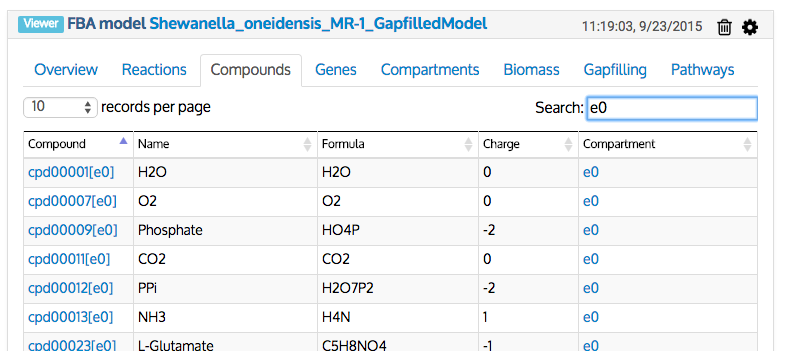
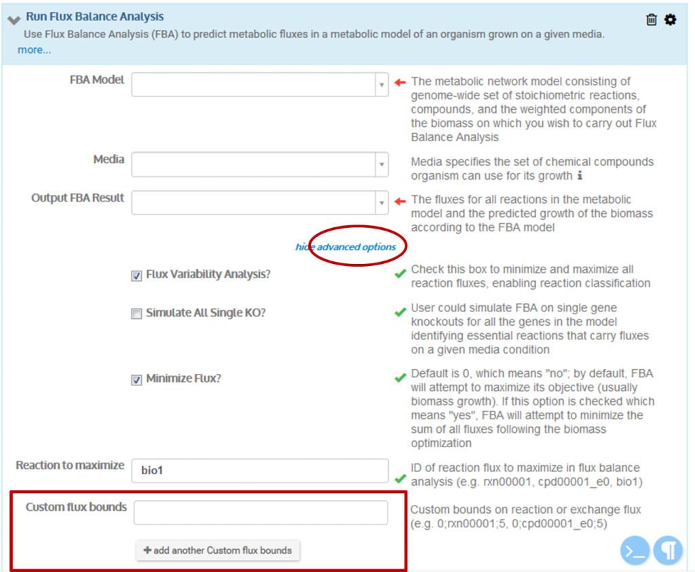
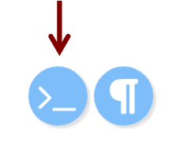
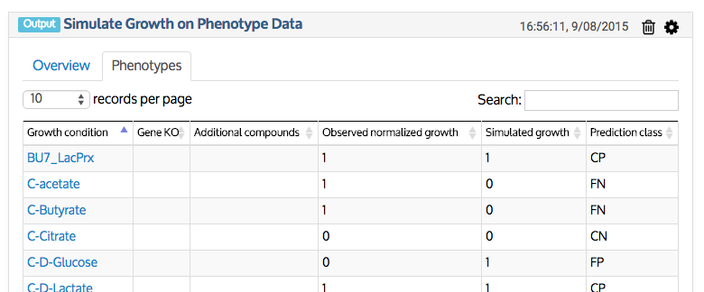

% Metabolic Modeling FAQ
% Author One; Author Two
% October 9, 2015

KBase has a suite of apps, methods, and data that support the reconstruction, prediction, and design of metabolic networks in microbes and plants. These tools could help advance, for example, efforts to optimize microbial production of a certain biofuel, find the minimal media conditions under which that fuel is generated, or predict soil amendments that improve the productivity of plant bioenergy feedstocks. 

Below are answers to common questions about KBase's metabolic modeling tools, including:

*   [What does the KBase gapfilling method do?](#What-does-the-KBase-gapfilling-method-do)
*   [How does the underlying gapfilling algorithm work (i.e., what kind of programming formulation does it use)?](#How-does-the-underlying-gapfilling-algorithm-work)
*   [How do I choose a media condition for gapfilling, and what is the default media used?](#How-do-I-choose-a-media-condition-for-gapfilling)
*   [How can I see the compounds comprising a media used in gapfilling?](#How-can-I-see-the-compounds-comprising-a-media-used-in-gapfilling)
*   [How can I download all the biochemical compounds and reactions in KBase?](#How-can-I-download-all-the-biochemical-compounds-and-reactions-in-KBase)
*   [Do the media in KBase include sources other than carbon (e.g., nitrogen, phosphorus, sulfur)?](#Do-the-media-in-KBase-include-sources-other-than-carbon)
*   [How can I specify my own media?](#How-can-I-specify-my-own-media)
*   [How is media data structured in KBase?](#How-is-media-data-structured-in-KBase)
*   [How can I determine if my metabolic model will grow in a certain media?](#How-can-I-determine-if-my-metabolic-model-will-grow-in-a-certain-media)
*   [After running flux balance analysis, what does the sign of a reaction flux mean?](#After-running-flux-balance-analysis-what-does-the-sign-of-a-reaction-flux-mean)
*   [Can I customize the flux boundaries of reactions in my model?](#Can-I-customize-the-flux-boundaries-of-reactions-in-my-model)
*   [How can I edit my metabolic model (add or delete reactions, compounds, or biomass)?](#How-can-I-edit-my-metabolic-model)
*   [Why did gapfilling fail for a model containing a custom media or custom biomass reaction? What can I do about it?](#Why-did-gapfilling-fail-for-a-model-containing-a-custom-media-or-custom-biomass-reaction)
*   [What if my source and translated metabolic models are the same after running the "Propagate Genome-scale Model to Close Genome" app?](#What-if-my-source-and-translated-metabolic-models-are-the-same)
*   [What do the "Prediction class" values mean in the output table generated by the "Simulate Growth on Phenotype Data" method?](#What-do-the-Prediction-class-values-mean)
*   [Why did I get false negatives after simulating growth, and what can I do about it?](#Why-did-I-get-false-negatives-after-simulating-growth)

For more information—including descriptions of the underlying algorithms, inputs, and outputs—see the [app and method](http://kbase.us/apps/) detail pages and [tutorials](http://kbase.us/tutorials/) for the relevant apps and methods, which are linked below. 

<div class="well">

## Metabolic Modeling Resources

<div class="row">
<div class="col-sm-7">

**Microbial Metabolic Model Reconstruction and Analysis**

*   Narrative tutorial (coming soon!)

**Reconstruct Genome-scale Metabolic Model**

*   [App details](https://narrative.kbase.us/functional-site/#/narrativestore/app/build_fba_model)
*   [Tutorial](http://kbase.us/reconstruct-genome-scale-metabolic-model-app/)

**Propagate Genome-scale Model to Close Genome**

*   [App details](https://narrative.kbase.us/functional-site/#/narrativestore/app/fba_model_translation)
*   [Tutorial](http://kbase.us/propagate-genome-scale-model-to-close-genome-app/)

**Reconstruct Community Metabolic Model**

*   [App details](https://narrative.kbase.us/functional-site/#/narrativestore/app/community_fba_modeling)
*   [Tutorial](http://kbase.us/reconstruct-community-metabolic-model/)

**Build Plant Metabolic Model**

*   [App details](https://narrative.kbase.us/functional-site/#/narrativestore/app/build_plant_metabolic_model)
*   [Tutorial](http://kbase.us/build-plant-metabolic-model-app/)

</div>
<div class="col-sm-5">

**Run Flux Balance Analysis**

*   [Method details](https://narrative.kbase.us/functional-site/#/narrativestore/method/run_flux_balance_analysis)
*   [Tutorial](http://kbase.us/run-flux-balance-analysis-method/)

**Simulate Growth on Phenotype Data**

*   [Methods details](https://narrative.kbase.us/functional-site/#/narrativestore/method/simulate_growth_on_a_phenotype_set)
*   [Tutorial](http://kbase.us/simulate-growth-on-phenotype-data-method/)

**Compare Two Metabolic Models**

*   [Method details](https://narrative.kbase.us/functional-site/#/narrativestore/method/compare_two_metabolic_models_generic)
*   [Tutorial](http://kbase.us/compare-two-metabolic-models-method/)

**Compare FBA solutions**

*   [Method details](https://narrative.kbase.us/functional-site/#/narrativestore/method/compare_fba_solutions)

**Gapfill Metabolic Models**

*   [Method details](https://narrative.kbase.us/functional-site/#/narrativestore/method/gapfill_a_metabolic_model)

</div>
</div>
</div>

## Q. What does the KBase gapfilling method do? {#What-does-the-KBase-gapfilling-method-do}

Draft metabolic models lack a number of essential reactions due to missing or inconsistent annotations. Some of the most common problems arise from having missing transporters (reactions that move metabolites across cell membranes) because they are difficult to annotate well. Consequently, draft models often are unable to generate biomass on media where the organism typically is capable of growing. 

The KBase gapfilling process compares the set of reactions in your metabolic model to a database of all known reactions and attempts to find a minimal set of reactions that, when added to your model, will allow it to grow. The set of reactions (known as the gapfilling solution) can then be integrated into your model, creating a new model capable of growth on the media used in the gapfilling process. 

The gapfilling method uses a cost function associated with each internal reaction and transporter to find a solution that uses the fewest reactions to fill all gaps, and it does this without extra knowledge about the organism’s biochemistry. 

For more information on gapfilling, see the [method details page](https://narrative.kbase.us/functional-site/#/narrativestore/method/gapfill_a_metabolic_model) and the Henry et al. 2010 [Model SEED paper](http://www.nature.com/nbt/journal/v28/n9/full/nbt.1672.html) in Nature Biotechnology.  

## Q: How does the underlying gapfilling algorithm work (i.e., what kind of programming formulation does it use)? {#How-does-the-underlying-gapfilling-algorithm-work}

At one time, KBase used a mixed-integer linear programming (MILP) formulation in gapfilling but replaced it with simple linear programming (LP), which minimizes the sum of flux through gapfilled reactions. From extensive experience with both formulations, KBase modeling experts have found that LP solutions are just as minimal as MILP solutions but require far less time to compute. In rare cases where an LP gapfilling would not be minimal, the lower wait time to obtain and adjust a new solution is typically worth a slightly larger solution. 

The LP insists on using minimal flux, which almost always corresponds with minimal reactions in a stoichiometrically consistent database. In fact, inefficient solutions were more likely to result from the former MILP formulation because KBase sometimes would cut off the solver before an optimal solution was found in order to limit run-times to 24 hours. 

In gapfilling, it is important to recognize that not all reactions are created equal. For example, transporters and non-KEGG reactions are penalized, along with reactions that have missing structures or unknown deltaG. To understand all the penalties, see the Henry et al. 2010 [Model SEED](http://www.nature.com/nbt/journal/v28/n9/full/nbt.1672.html) paper in _Nature Biotechnology_. 

The gapfilling method always has reasons for adding the reactions it does, but those reasons admittedly are not always obvious or biologically relevant. KBase is working on an algorithm that would provide detailed explanations of why each gapfilled reaction is added; we hope to make this feature available within the next few months.  

## Q: How do I choose a media condition for gapfilling, and what is the default media used? {#How-do-I-choose-a-media-condition-for-gapfilling}

“Gapfilling” refers to choosing the minimal set of reactions to add to a draft metabolic model that will enable it to produce biomass in a specified media. KBase’s gapfilling method lets you set the media condition (i.e., the metabolites available in the environment in which you want to analyze the growth of your organism). For more information, see the [Gapfilling ](https://narrative.kbase.us/functional-site/#/narrativestore/method/gapfill_a_metabolic_model)[method details page](https://narrative.kbase.us/functional-site/#/narrativestore/method/gapfill_a_metabolic_model) and the previous question. 

If you leave the Media field blank, “complete” media will be used by default. Complete media is a special type of media that does not include an exact list of compounds. Instead, complete media consists of all metabolites for which a transporter is available in the KBase biochemistry database. When used on complete media, the gapfilling method is not limited by the transport reactions already available in the model and therefore invariably will add more transport reactions to the model. 

In addition to the default complete media, KBase provides more than 500 media conditions you can use for gapfilling. The [Narrative Interface User Guide](http://kbase.us/narrative-guide/add-data-to-your-narrative/) describes how to add these media and other data to your Narrative. You can also [upload your own custom media condition](http://kbase.us/data-upload-download-guide/media/). 

Choosing minimal media for the initial gapfilling is often a good idea because it ensures that the gapfilling algorithm will add the maximal set of reactions to the genome-inferred model. This will allow the model to biosynthesize many common substrates necessary for growth—substrates that otherwise would be present in the media. The gapfilling algorithm looks for incomplete metabolic pathways and tries to make an informed guess as to which protein-encoding genes may be responsible for the missing step in the pathway. This process works best when informed by the _a priori_ knowledge that a particular organism can grow on a defined media type (e.g., a model of _Helicobacter pylori_, an endosymbiont, might require a media containing substrates it can’t biosynthesize _in vivo_.) Thus, specifying a growth media is beneficial. 

Note that gapfilling runs can be stacked. That is, you can gapfill in complete media and then subsequently gapfill the model again in minimal media. The model will retain both gapfilling solutions. If you want to gapfill on the two media independently, be careful not to overwrite your original model during your gapfilling simulations and then use the same original model in both gapfilling runs. 

The [tutorial for the _Reconstruct Genome-scale Metabolic Model_ app](http://kbase.us/reconstruct-genome-scale-metabolic-model-app/) explores the differences between two gapfilled solutions: one generated on complete media, and one generated on minimal media.  

## Q. How can I see the compounds comprising a media used in gapfilling? {#How-can-I-see-the-compounds-comprising-a-media-used-in-gapfilling}

To see the list of media compounds for a particular model, open a viewer for the model by either clicking on its name in the Data Panel or dragging it from the panel and dropping it into the main Narrative window. Select the _Compounds_ tab and filter by “e0” (extracellular compartment). This gives you a complete list of compounds transportable by your model. 

[](images/search-for-extracellular-compartment.png)  

## Q: When viewing a model, what do the compartment IDs mean? {#When-viewing-a-model-what-do-the-compartment-IDs-mean}

Compartments are the subcellular localization of compounds, enzymes, and reactions. The table below lists compartment abbreviations for microbes and plants. 

Reactions and compounds belonging to each compartment are identified using compartment notation in square brackets after the five-digit reaction or compound ID (e.g., rxn00001[c0], cpd00001[c0]). 

The integer associated with the compartment (e.g., the 0 in c0) represents the index number of the model. For a single-species model, this number will always be zero, but if individual models are merged into a community model, each sub-model will then be assigned a distinct index.

Compartment               Microbes   Plants  
-----------               --------  --------
Cytosol (c)                  ✓       ✓ 
Plastid (d)                          ✓ 
Extracellular (e)            ✓       ✓ 
Golgi apparatus (g)                  ✓ 
Mitochondria (m)                     ✓ 
Nucleus (n )                         ✓ 
Periplasm (p)                ✓ 
Endoplasmic reticulum (r)            ✓ 
Vacuole (v)                          ✓ 
Cell wall (w)                        ✓ 
Peroxisome (x)                       ✓ 

## Q: How can I download all the biochemical compounds and reactions in KBase? {#How-can-I-download-all-the-biochemical-compounds-and-reactions-in-KBase}

The biochemistry compounds and reactions can be downloaded (as Excel spreadsheets) from [ftp://ftp.kbase.us/assets/KBase_Reference_Data/Biochemistry](ftp://ftp.kbase.us/assets/KBase_Reference_Data/Biochemistry).  

## Q: Do the media in KBase include sources other than carbon (e.g., nitrogen, phosphorus, sulfur)? {#Do-the-media-in-KBase-include-sources-other-than-carbon}

Every KBase media has all the compounds necessary for minimal growth. In most cases the significant difference among media is the carbon source, which generally dictates the media’s name (e.g., “Carbon-D-Glucose”).  

## Q: How can I specify my own media? {#How-can-I-specify-my-own-media}

You can generate and import your own media file by specifying the biochemical compounds found in a particular growth environment. Go to [ftp://ftp.kbase.us/assets/KBase_Reference_Data/Biochemistry](ftp://ftp.kbase.us/assets/KBase_Reference_Data/Biochemistry) to see a list of all the biochemical compounds in KBase and find the IDs for those you wish to include in your custom media. Media can be uploaded as a TSV (tab-separated values) or Excel file with four columns:

*   Compound identifier (e.g., ModelSEED ID, KEGG ID, PubChem ID, or compound name such as “glucose”)
*   Concentration (concentration of compound in M/L)
*   Min flux (minimum allowed uptake/excretion of compound)
*   Max flux (maximum allowed uptake/excretion of compound)

Below is an example of a media file in TSV format. In this case, the compound IDs in the first column are ModelSEED IDs. 

[](media-file-output-tsv-format.png) 

Note that when creating a media Excel file, the name of the worksheet that contains your media conditions must be named “MediaCompounds” or it will not upload. To rename a worksheet, find the worksheet tabs at the bottom left of the Excel file. Double-click on the default name of the spreadsheet containing your custom media and name it “MediaCompounds.” 

[](images/media-compounds-tab-in-excel-spreadsheet.png) 

The values in the “minflux” and “maxflux” columns are absolute units that represent the range of possible fluxes for reactions that transport the media compounds into and out of the cell. A negative flux value corresponds to excretion (transport out of the cell), and a positive flux value corresponds to uptake (transport into the cell). 

The combination of maximum and minimum flux will dictate whether uptake and/or excretion of a reagent is allowed. Assigning a positive number to “minflux” for a particular compound essentially forces uptake of that compound. Conversely, assigning a negative number to “maxflux” will force excretion of the compound. 

If you specify a range between “minflux” and “maxflux," then you will need to look at the list of “Exchange Fluxes” in the output after running flux balance analysis to observe what actually happened during the growth simulation.  

[](images/exchange-fluxes-data-viewer-tab.png) 

Please see the “Media” section of the Data Guide ([http://kbase.us/data-upload-download-guide/media](http://kbase.us/data-upload-download-guide/media)) for more information on how to configure your media file.  

## Q: How is media data structured in KBase? {#How-is-media-data-structured-in-KBase}

As with all KBase data types, the technical “spec” files of media data can be viewed at  [https://narrative.kbase.us/functional-site/#/spec/storage/0](https://narrative.kbase.us/functional-site/#/spec/storage/0). 

From here, you can find details on the structure of media data in KBase by navigating the following path: “KBaseBiochem” → “Types”→ “Media” → “Spec file.” Scroll to the bottom of the media spec file to see the overall data structure, which should look like this:

```
typedef structure {
  media_id id;
  string name;
  source_id source_id;
  string source;
  string protocol_link;
  bool isDefined;
  bool isMinimal;
  bool isAerobic;
  string type;
  string pH_data;
  float temperature;
  string atmosphere;
  string atmosphere_addition;
  list<MediaReagent> reagents;
  list<MediaCompound> mediacompounds;
} Media;
```

## Q. How can I determine if my metabolic model will grow in a certain media? {#How-can-I-determine-if-my-metabolic-model-will-grow-in-a-certain-media}

Once you have built a metabolic model, you can perform flux balance analysis (FBA) to calculate the flow of metabolites through your model. FBA results can be used to predict the growth rate of an organism under certain conditions or the production rates for particular metabolites of interest. 

To determine whether your organism grew in the media that you specified for FBA, find the _Overview_ tab in the FBA results table. Among the summary information in this tab is the **objective value**. This value is is significant because it represents the maximum achievable flux through the biomass reaction of the metabolic model. An objective value of 0 (or something very close to 0) means that the model did not grow on the specified media. 

[](images/overview-tab-fba-results.png) 

For more information on the “Run Flux Balance Analysis” method, see the [method details page](https://narrative.kbase.us/functional-site/#/narrativestore/method/run_flux_balance_analysis).  

## Q: After running flux balance analysis, what does the sign of a reaction flux mean? {#After-running-flux-balance-analysis-what-does-the-sign-of-a-reaction-flux-mean}

A positive flux value indicates that a reaction is proceeding from left to right as written in the equation, while a negative value indicates the reaction is running from right to left. For example, the following table shows a portion of the _“Reaction fluxes”_ tab from the output of the “[Run Flux Balance Analysis](http://kbase.us/run-flux-balance-analysis-method/)” method. Here, the positive flux in the “Flux” column indicates that rxn00543 is proceeding from left to right—that is, ethanol is being oxidized to acetaldehyde.

| **Reaction** | **Name**                   | **Flux** | **Min flux (Lower bound)** | **Max flux (Upper bound)** | **Class** | **Equation** |
| ---          | ---                        | ---      | ---                        | ---                        | ---       | ---          |
| rxn00543[c0] | Ethanol-NAD oxidoreductase | 100      | -100 (-1000)               | 100 (1000)                 | Variable  | NAD[c0] + Ethanol[c0] <=> Acetaldehyde[c0] + NADH[c0] + H+[c0] |

The “Min flux,” “Max flux,” and “Class” columns show that other valid FBA solutions for the model have flux values for rxn00543 that range from -100 to 100\. This reaction therefore is classified as “Variable” because it can proceed in either direction.  

## Q: Can I customize the flux boundaries of reactions in my model? {#Can-I-customize-the-flux-boundaries-of-reactions-in-my-model}

To constrain the flux of a reaction, you can export your model, edit it, and re-import it. 

Alternatively, in the case of a transport reaction, you can change the uptake of a media compound by editing the media object itself. For example, setting the maximum flux of any media compound to zero (or a small number) will prevent its uptake. This is contingent, of course, on the media itself being defined, so if you performed gapfilling on the default complete media, you will have to re-gapfill on an actual defined media object of your choice. 

Also, in the “[Run Flux Balance Analysis](http://kbase.us/run-flux-balance-analysis-method/)” method, you can change the “bounds” on a specific reaction to whatever you want using the “Custom flux bounds” field under advanced options: [](images/advanced-options-flux-balance-analysis.png) Note that the help text next to the custom flux field provides an example of the proper format for setting bounds:  

*   Specify a number for the lower bound (e.g. "0")
*   Insert a semicolon (no spaces!)
*   Type in the reaction ID or compound ID
*   Insert another semicolon
*   Specify a number for the upper bound (e.g. "5")

So to set "rxn00006" at a flux of "5," you would set this custom bound: 5;rxn00006;5.  

## Q. How can I edit my metabolic model (add or delete reactions, compounds, or biomass)? {#How-can-I-edit-my-metabolic-model}

The KBase team is working to incorporate built-in capabilities for editing metabolic models within the Narrative Interface. For now, you can adjust your model by running scripts in a code cell. To add a code cell to your Narrative, click the “>_” icon at the bottom right of the Narrative screen. 

 

Instructions and example scripts for editing the reactions, compounds, and biomass in your model are available in the “[Manipulating Metabolic Models in Narrative](https://narrative.kbase.us/narrative/ws.7924.obj.1)” tutorial. Another way to adjust your model is to download it from KBase, edit the file, and then re-import it.   

## Q: Why did gapfilling fail for a model containing a custom media or custom biomass reaction? What can I do about it? {#Why-did-gapfilling-fail-for-a-model-containing-a-custom-media-or-custom-biomass-reaction}

If the “[Gapfill Metabolic Model](https://narrative.kbase.us/functional-site/#/narrativestore/method/gapfill_a_metabolic_model)” method fails with custom media, first check whether the compound that you are gapfilling for is already available in the reconstructed model. (See instructions for viewing model compounds above.) 

If the compound is not in the model, it may be rare or uncommon. Check KBase’s reference biochemistry database  ([ftp://ftp.kbase.us/assets/KBase_Reference_Data/Biochemistry](ftp://ftp.kbase.us/assets/KBase_Reference_Data/Biochemistry)) to ensure that:

*   The compound is actually available in KBase’s biochemistry collection.
*   There are reactions that involve the compound in question.
*   There are exchange reactions (transporters) that would enable the compound to be consumed from the media.

To help mitigate this issue, the “Gapfill Metabolic Model” method includes a field for “Source Gapfill Model” under the advanced options. You can specify a source model to supply reactions missing from the KBase database that might prevent the gapfilling from working successfully. If your biomass reaction is from an existing published model, you should import this model and use it as a source database for your gapfilling (because that model should contain all reactions needed to grow on its own biomass reaction). The source model simply supplements the KBase database, which still will be used in gapfilling.Successfully running the gapfilling method with a custom biomass reaction depends on whether the custom biomass includes compounds that can be produced given all the balanced, approved reactions in the KBase database. For now, non-standard compartments for biomass components may also be a problem. 

KBase uses a biochemistry database that includes all ModelSEED reactions, and some additional reactions (this database can be downloaded from [ftp://ftp.kbase.us/assets/KBase_Reference_Data/Biochemistry](ftp://ftp.kbase.us/assets/KBase_Reference_Data/Biochemistry)). However, the gapfilling is restricted to a subset of the reactions in the database. First and foremost, KBase filters out imbalanced reactions from gapfilling because they cause mass leakage and a bad gapfilling solution. We also filter out several reactions that cause problems in gapfilling due to strange formulations (e.g., reactions containing lumped or undefined compounds).  

## Q: What if my source and translated metabolic models are the same after running the “[Propagate Genome-scale Model to Close Genome](http://kbase.us/propagate-genome-scale-model-to-close-genome-app/)” app? {#What-if-my-source-and-translated-metabolic-models-are-the-same}

This app builds a new metabolic model by translating the gene associations in an existing model to a new genome. This translation is conducted based on gene correspondence tables contained in a proteome comparison object generated in Step 1 of the app. A gapfilling is performed to permit the translated model to grow on a specific media. More information on the model translation step can be found on the [details page](https://narrative.kbase.us/functional-site/#/narrativestore/method/translate_model_to_new_genome).

If the translated model resulting from this app is the same as your source model, run through the following checks:

*   **Make sure the reactions in the source model have genes associated with them.** If they don’t, then the source and translated models will be the same because reactions with no genes are automatically retained in the model propagation process. For this reason, it is very important to associate a genome with your model when you import it. It is equally important that the gene IDs in this associated genome match the gene IDs mapped to the reactions in your imported model **exactly**. Otherwise, the genes in the genome will not be properly mapped to the reactions in the model. This proper mapping is absolutely essential for apps such “Propagate Genome-scale Model to Close Genome” to work.
*   **Look at the proteome comparison object.** How different are the genomes that are being compared? How many hits are there? If the genomes are very close, the source and translated model could end up being the same. Such a result is unlikely but not impossible.
*   **Check the translated model before gapfilling.** Did you lose some reactions only to have them added back in the gapfilling process?

## Q: What do the “Prediction class” values mean in the output table generated by the “Simulate Growth on Phenotype Data” method? {#What-do-the-Prediction-class-values-mean}

The “[Simulate Growth on Phenotype Data](https://narrative.kbase.us/functional-site/#/narrativestore/method/simulate_growth_on_a_phenotype_set)” method performs multiple flux balance analyses (FBA) using each media condition in a phenotype dataset and compares the results, which are listed as "Observed normalized growth" (experiments done in a laboratory) vs. "Simulated growth" (simulation of FBA on the model). You can see these results in the _Phenotypes_ tab of the output cell: 

[](images/phenotypes-tab-stimulate-growth-on-phenotype-data-output.png) 

In the “Prediction class” column, simulated growth results against observed growth are represented in four classes: 

------   --------------------------------------------------------
**CP**   Correct positive (model was predicted to grow, and did) 
**CN**   Correct negative (model was predicted not to grow, and did not) 
**FP**   False positive (model was predicted to grow, but it did not) 
**FN**   False negative (model was predicted not to grow, but it did)  
------   --------------------------------------------------------

## Q: Why did I get false negatives after simulating growth, and what can I do about it? {#Why-did-I-get-false-negatives-after-simulating-growth}

False negative (FN) results from the “[Simulate Growth on Phenotype Data](https://narrative.kbase.us/functional-site/#/narrativestore/method/simulate_growth_on_a_phenotype_set)” method mean that the model is not able to grow on laboratory-tested media conditions. The most likely explanation for a FN prediction is that the model is missing reactions required for viable growth in the specified media conditions (e.g., no asparagine metabolism pathway in a media where asparagine is the only carbon source). This error can be corrected by gapfilling the model on that media to add a minimal set of reactions to the model such that growth is permitted.  

---

We welcome your [feedback](http://kbase.us/contact-us) on the information provided in this FAQ. If you have a question about the metabolic modeling tools and data in KBase that is not answered here, or the answer provided didn't work for you, please [contact us](http://kbase.us/contact-us).